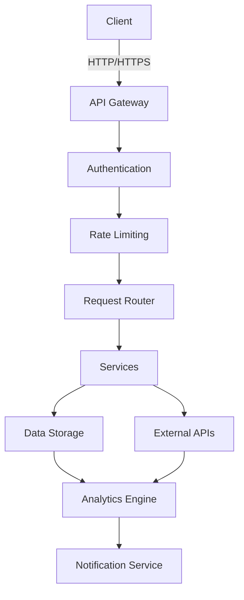

# Developer Guide

This guide provides information for developers looking to extend or contribute to the Reputation Monitor system.

## Architecture

### System Overview



### Core Components

1. **API Layer**
   - RESTful API endpoints
   - Authentication & Authorization
   - Request validation
   - Rate limiting

2. **Data Collection**
   - Social media connectors (Twitter, Reddit, etc.)
   - Web crawlers
   - RSS/Atom feed readers

3. **Processing Pipeline**
   - Data normalization
   - Sentiment analysis
   - Entity recognition
   - Duplicate detection

4. **Storage**
   - Relational database (PostgreSQL)
   - Document store (MongoDB)
   - Cache (Redis)
   - Object storage (S3)

5. **Analytics**
   - Real-time processing
   - Batch processing
   - Machine learning models

6. **Frontend**
   - Dashboard (React/Vue.js)
   - Real-time updates (WebSockets)
   - Data visualization (D3.js/Chart.js)

## Development Setup

### Prerequisites

- Python 3.8+
- Node.js 16+
- Docker & Docker Compose
- PostgreSQL 13+
- Redis 6+

### Local Development

1. **Clone the repository**
   ```bash
   git clone https://github.com/yourusername/Online-bad-reputation-.git
   cd Online-bad-reputation-
   ```

2. **Set up Python environment**
   ```bash
   python -m venv venv
   source venv/bin/activate  # On Windows: .\venv\Scripts\activate
   pip install -r requirements-dev.txt
   ```

3. **Set up frontend**
   ```bash
   cd frontend
   npm install
   npm run dev
   ```

4. **Run services with Docker**
   ```bash
   docker-compose up -d postgres redis
   ```

5. **Run database migrations**
   ```bash
   alembic upgrade head
   ```

6. **Start the development server**
   ```bash
   uvicorn app.main:app --reload
   ```

## Extending Functionality

### Adding a New Data Source

1. Create a new module in `sources/`
2. Implement the `BaseSource` interface
3. Register the source in `sources/__init__.py`
4. Add tests in `tests/sources/`

### Creating a New Analyzer

1. Create a new class in `analyzers/`
2. Implement the `BaseAnalyzer` interface
3. Register the analyzer in `analyzers/__init__.py`
4. Add tests in `tests/analyzers/`

### Adding a New Visualization

1. Create a new React component in `frontend/src/components/visualizations/`
2. Register the component in `frontend/src/visualizationRegistry.js`
3. Add tests in `frontend/src/tests/`

## Testing

### Running Tests

```bash
# Run all tests
pytest

# Run specific test file
pytest tests/test_models.py

# Run with coverage
pytest --cov=app tests/
```

### Test Structure

```
tests/
├── __init__.py
├── conftest.py
├── unit/
│   ├── test_models.py
│   └── test_services.py
├── integration/
│   ├── test_api.py
│   └── test_integrations.py
└── e2e/
    └── test_workflows.py
```

## Code Style

- Follow [PEP 8](https://www.python.org/dev/peps/pep-0008/)
- Use type hints
- Write docstrings for all public methods
- Keep functions small and focused
- Use meaningful variable names

## Documentation

### Building Documentation

```bash
# Install dependencies
pip install -r docs/requirements.txt

# Build HTML docs
cd docs
make html
```

### Documentation Structure

```
docs/
├── source/
│   ├── _static/
│   ├── _templates/
│   ├── user/
│   ├── developer/
│   ├── api/
│   └── index.rst
└── build/
```

## Deployment

### Production Setup

1. **Infrastructure**
   - Kubernetes cluster
   - Managed database (RDS/Cloud SQL)
   - Object storage (S3/GCS)
   - CDN

2. **Configuration**
   - Environment variables
   - Secrets management
   - Feature flags

3. **CI/CD**
   - Automated testing
   - Container builds
   - Blue/green deployment

## Monitoring & Observability

### Metrics

- Application metrics (Prometheus)
- Business metrics
- Custom dashboards (Grafana)

### Logging

- Structured logging (JSON)
- Log levels
- Log rotation

### Tracing

- Distributed tracing (Jaeger/Zipkin)
- Performance metrics
- Error tracking

## Security

### Best Practices

- Input validation
- Output encoding
- Authentication & authorization
- Rate limiting
- CORS configuration
- Security headers

### Security Tools

- Dependency scanning
- Static analysis
- Dynamic analysis
- Secret detection

## Contributing

1. Fork the repository
2. Create a feature branch
3. Make your changes
4. Write tests
5. Submit a pull request

### Pull Request Checklist

- [ ] Tests pass
- [ ] Documentation updated
- [ ] Code follows style guide
- [ ] No security issues
- [ ] Changelog updated

## Support

For support, please:

1. Check the [Troubleshooting Guide](troubleshooting.md)
2. Search existing issues
3. Open a new issue with details

## License

This project is licensed under the MIT License - see the [LICENSE file](https://github.com/pranav271103/Reputation-Monitor/blob/main/LICENSE) in the repository for details.
